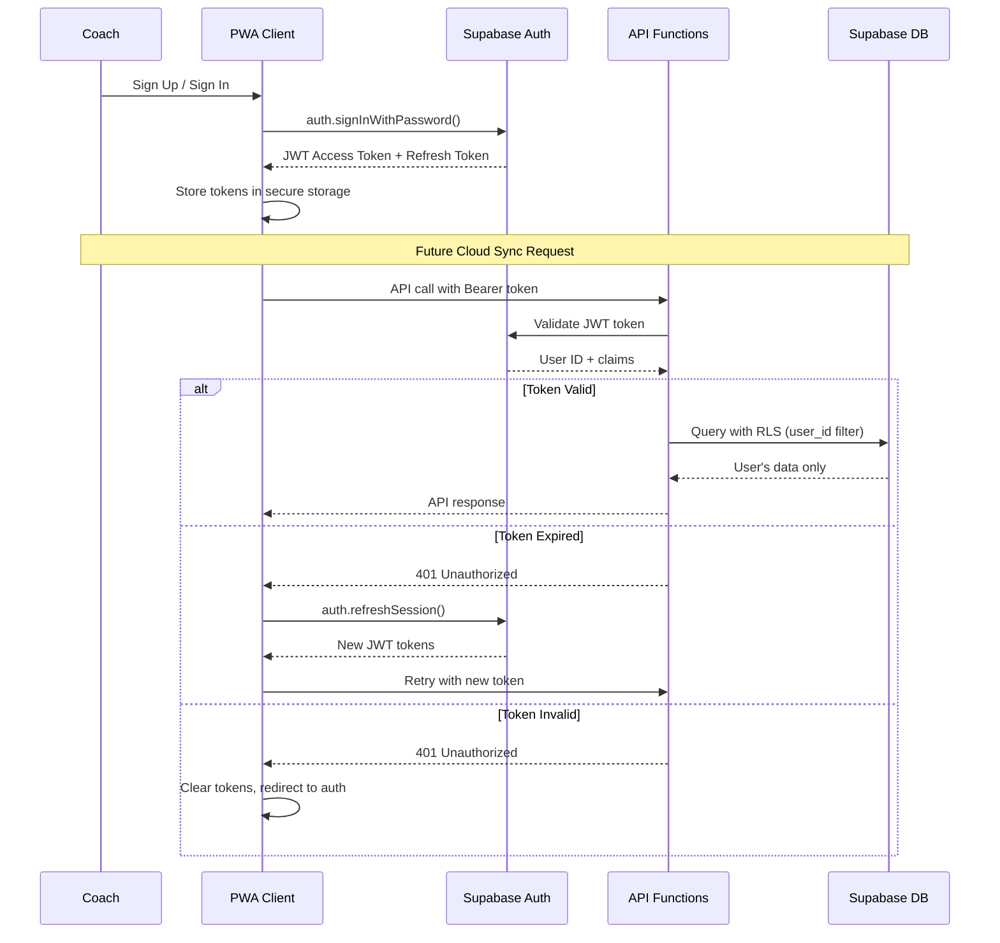

# Backend Architecture

The backend architecture is designed for **future Phase 2 enhancement** - the MVP operates entirely client-side. The planned backend uses Next.js API Routes deployed as Vercel serverless functions for cloud sync and multi-device support.

## Service Architecture

Based on our platform choice of Vercel + Supabase, the backend follows a **serverless architecture** pattern with clear separation between current offline-first operation and future cloud enhancement.

### Serverless Architecture

#### Function Organization

```
apps/api/src/
├── routes/                              # API route handlers
│   ├── teams/
│   │   ├── route.ts                     # GET /api/teams, POST /api/teams
│   │   └── [teamId]/
│   │       ├── route.ts                 # GET/PATCH/DELETE /api/teams/:id
│   │       ├── players/
│   │       │   └── route.ts             # Team roster management
│   │       └── games/
│   │           └── route.ts             # Team game history
│   ├── sync/
│   │   ├── upload/
│   │   │   └── route.ts                 # POST /api/sync/upload
│   │   └── download/
│   │       └── route.ts                 # GET /api/sync/download
│   └── auth/
│       ├── callback/
│       │   └── route.ts                 # OAuth callback handler
│       └── refresh/
│           └── route.ts                 # Token refresh endpoint
├── services/                            # Business logic services
│   ├── syncService.ts                   # Data synchronization logic
│   ├── conflictResolution.ts            # Multi-device conflict handling
│   ├── teamService.ts                   # Team management operations
│   └── gameService.ts                   # Game data processing
├── middleware/                          # Request processing
│   ├── auth.ts                          # JWT validation middleware
│   ├── validation.ts                    # Request/response validation
│   ├── rateLimiting.ts                  # API rate limiting
│   └── errorHandling.ts                 # Centralized error processing
├── utils/                               # Shared utilities
│   ├── supabase.ts                      # Supabase client configuration
│   ├── validation.ts                    # Data validation schemas
│   └── dateUtils.ts                     # Timestamp handling for sync
└── types/                               # API-specific TypeScript types
    ├── api.ts                           # Request/response interfaces
    ├── sync.ts                          # Synchronization data types
    └── database.ts                      # Supabase table interfaces
```

#### Function Template

```typescript
// Standard serverless function template with error handling
import { NextRequest, NextResponse } from 'next/server';
import { createClient } from '@supabase/supabase-js';
import { validateJWT, extractUserFromToken } from '@/middleware/auth';
import { validateRequestBody } from '@/middleware/validation';
import { handleAPIError } from '@/middleware/errorHandling';
import type { SyncUploadRequest, SyncUploadResponse } from '@/types/api';

// POST /api/sync/upload - Upload local game data for cloud backup
export async function POST(request: NextRequest): Promise<NextResponse> {
  try {
    // Authentication middleware
    const authResult = await validateJWT(request);
    if (!authResult.valid) {
      return NextResponse.json(
        { error: { code: 'UNAUTHORIZED', message: 'Invalid authentication' } },
        { status: 401 }
      );
    }

    const userId = authResult.userId;

    // Request validation
    const requestBody: SyncUploadRequest = await request.json();
    const validationResult = validateRequestBody(requestBody, 'syncUpload');
    if (!validationResult.valid) {
      return NextResponse.json(
        { error: { code: 'VALIDATION_ERROR', message: validationResult.errors } },
        { status: 400 }
      );
    }

    // Initialize Supabase client
    const supabase = createClient(
      process.env.SUPABASE_URL!,
      process.env.SUPABASE_SERVICE_KEY!
    );

    // Process sync data
    const syncResult = await processSyncUpload(
      supabase,
      userId,
      requestBody.games,
      requestBody.lastSyncTimestamp
    );

    const response: SyncUploadResponse = {
      syncedCount: syncResult.processed,
      conflicts: syncResult.conflicts,
      timestamp: new Date().toISOString()
    };

    return NextResponse.json(response, { status: 200 });

  } catch (error) {
    console.error('Sync upload error:', error);
    return handleAPIError(error);
  }
}

async function processSyncUpload(
  supabase: SupabaseClient,
  userId: string,
  games: Game[],
  lastSync: string | null
): Promise<{ processed: number; conflicts: ConflictData[] }> {
  const conflicts: ConflictData[] = [];
  let processed = 0;

  for (const game of games) {
    try {
      // Check for conflicts with existing data
      const { data: existing } = await supabase
        .from('games')
        .select('updated_at')
        .eq('id', game.id)
        .eq('user_id', userId)
        .single();

      if (existing && existing.updated_at > game.updatedAt) {
        // Server data is newer - record conflict
        conflicts.push({
          entityId: game.id,
          entityType: 'game',
          localTimestamp: game.updatedAt,
          serverTimestamp: existing.updated_at
        });
        continue;
      }

      // Upsert game data
      const { error } = await supabase
        .from('games')
        .upsert({
          ...game,
          user_id: userId,
          updated_at: new Date().toISOString()
        });

      if (error) throw error;
      processed++;

    } catch (error) {
      console.error(`Failed to sync game ${game.id}:`, error);
      // Continue processing other games
    }
  }

  return { processed, conflicts };
}

// Rate limiting for sync endpoints
export const runtime = 'edge';
export const maxDuration = 30; // 30 seconds max execution time
```

## Database Architecture

The backend leverages **Supabase PostgreSQL** for cloud storage with **Row Level Security (RLS)** for multi-tenant data isolation.

### Schema Design

```sql
-- Supabase PostgreSQL schema for cloud sync
-- Row Level Security ensures data isolation between users

-- Enable required extensions
CREATE EXTENSION IF NOT EXISTS "uuid-ossp";
CREATE EXTENSION IF NOT EXISTS "pgcrypto";

-- User profiles (extends Supabase auth.users)
CREATE TABLE public.profiles (
  id UUID REFERENCES auth.users(id) PRIMARY KEY,
  email TEXT NOT NULL,
  full_name TEXT,
  created_at TIMESTAMP WITH TIME ZONE DEFAULT NOW(),
  updated_at TIMESTAMP WITH TIME ZONE DEFAULT NOW()
);

-- Teams table with RLS
CREATE TABLE public.teams (
  id UUID DEFAULT uuid_generate_v4() PRIMARY KEY,
  user_id UUID REFERENCES public.profiles(id) NOT NULL,
  name TEXT NOT NULL CHECK (length(name) <= 100),
  settings JSONB NOT NULL DEFAULT '{}',
  created_at TIMESTAMP WITH TIME ZONE DEFAULT NOW(),
  updated_at TIMESTAMP WITH TIME ZONE DEFAULT NOW()
);

-- Players table with RLS
CREATE TABLE public.players (
  id UUID DEFAULT uuid_generate_v4() PRIMARY KEY,
  team_id UUID REFERENCES public.teams(id) ON DELETE CASCADE,
  user_id UUID REFERENCES public.profiles(id) NOT NULL,
  name TEXT NOT NULL CHECK (length(name) <= 100),
  jersey_number INTEGER NOT NULL CHECK (jersey_number BETWEEN 1 AND 99),
  positions TEXT[] NOT NULL,
  is_active BOOLEAN DEFAULT true,
  created_at TIMESTAMP WITH TIME ZONE DEFAULT NOW(),
  updated_at TIMESTAMP WITH TIME ZONE DEFAULT NOW(),

  UNIQUE(team_id, jersey_number)
);

-- Games table with RLS
CREATE TABLE public.games (
  id UUID DEFAULT uuid_generate_v4() PRIMARY KEY,
  team_id UUID REFERENCES public.teams(id) ON DELETE CASCADE,
  user_id UUID REFERENCES public.profiles(id) NOT NULL,
  date TIMESTAMP WITH TIME ZONE NOT NULL,
  opponent TEXT,
  venue TEXT,
  status TEXT NOT NULL DEFAULT 'setup' CHECK (status IN ('setup', 'first-half', 'halftime', 'second-half', 'completed')),
  game_timer JSONB NOT NULL DEFAULT '{}',
  current_formation JSONB NOT NULL DEFAULT '{}',
  strategy JSONB NOT NULL DEFAULT '{}',
  created_at TIMESTAMP WITH TIME ZONE DEFAULT NOW(),
  updated_at TIMESTAMP WITH TIME ZONE DEFAULT NOW()
);

-- Playing time records with RLS
CREATE TABLE public.playing_time_records (
  id UUID DEFAULT uuid_generate_v4() PRIMARY KEY,
  player_id UUID REFERENCES public.players(id) ON DELETE CASCADE,
  game_id UUID REFERENCES public.games(id) ON DELETE CASCADE,
  user_id UUID REFERENCES public.profiles(id) NOT NULL,
  start_time TIMESTAMP WITH TIME ZONE NOT NULL,
  end_time TIMESTAMP WITH TIME ZONE,
  position TEXT NOT NULL CHECK (position IN ('goalkeeper', 'defender', 'midfielder', 'forward')),
  duration_seconds INTEGER GENERATED ALWAYS AS (
    CASE
      WHEN end_time IS NULL THEN 0
      ELSE EXTRACT(EPOCH FROM end_time - start_time)::INTEGER
    END
  ) STORED,
  created_at TIMESTAMP WITH TIME ZONE DEFAULT NOW()
);

-- Substitution events with RLS
CREATE TABLE public.substitution_events (
  id UUID DEFAULT uuid_generate_v4() PRIMARY KEY,
  game_id UUID REFERENCES public.games(id) ON DELETE CASCADE,
  user_id UUID REFERENCES public.profiles(id) NOT NULL,
  player_off_id UUID REFERENCES public.players(id),
  player_on_id UUID REFERENCES public.players(id),
  position JSONB NOT NULL,
  game_time_seconds INTEGER NOT NULL,
  reason TEXT NOT NULL CHECK (reason IN ('strategy', 'injury', 'disciplinary', 'playing-time', 'tactical')),
  timestamp TIMESTAMP WITH TIME ZONE DEFAULT NOW(),

  CHECK (player_off_id != player_on_id)
);

-- Row Level Security policies
ALTER TABLE public.teams ENABLE ROW LEVEL SECURITY;
ALTER TABLE public.players ENABLE ROW LEVEL SECURITY;
ALTER TABLE public.games ENABLE ROW LEVEL SECURITY;
ALTER TABLE public.playing_time_records ENABLE ROW LEVEL SECURITY;
ALTER TABLE public.substitution_events ENABLE ROW LEVEL SECURITY;

-- RLS policies for data isolation
CREATE POLICY "Users can only access their own teams"
  ON public.teams FOR ALL
  USING (auth.uid() = user_id);

CREATE POLICY "Users can only access their own players"
  ON public.players FOR ALL
  USING (auth.uid() = user_id);

CREATE POLICY "Users can only access their own games"
  ON public.games FOR ALL
  USING (auth.uid() = user_id);

CREATE POLICY "Users can only access their own playing time records"
  ON public.playing_time_records FOR ALL
  USING (auth.uid() = user_id);

CREATE POLICY "Users can only access their own substitution events"
  ON public.substitution_events FOR ALL
  USING (auth.uid() = user_id);

-- Indexes for performance
CREATE INDEX idx_teams_user_created ON public.teams(user_id, created_at);
CREATE INDEX idx_players_team_active ON public.players(team_id, is_active);
CREATE INDEX idx_games_team_date ON public.games(team_id, date DESC);
CREATE INDEX idx_playing_time_game ON public.playing_time_records(game_id, start_time);
CREATE INDEX idx_substitution_game ON public.substitution_events(game_id, game_time_seconds);

-- Functions and triggers for updated_at timestamps
CREATE OR REPLACE FUNCTION update_updated_at_column()
RETURNS TRIGGER AS $$
BEGIN
  NEW.updated_at = NOW();
  RETURN NEW;
END;
$$ language 'plpgsql';

CREATE TRIGGER update_teams_updated_at
  BEFORE UPDATE ON public.teams
  FOR EACH ROW EXECUTE FUNCTION update_updated_at_column();

CREATE TRIGGER update_players_updated_at
  BEFORE UPDATE ON public.players
  FOR EACH ROW EXECUTE FUNCTION update_updated_at_column();

CREATE TRIGGER update_games_updated_at
  BEFORE UPDATE ON public.games
  FOR EACH ROW EXECUTE FUNCTION update_updated_at_column();
```

### Data Access Layer

```typescript
// Repository pattern for Supabase data access
import { createClient, SupabaseClient } from '@supabase/supabase-js';
import type { Team, Player, Game } from '@shared/types';

class TeamRepository {
  private supabase: SupabaseClient;

  constructor(supabaseUrl: string, serviceKey: string) {
    this.supabase = createClient(supabaseUrl, serviceKey);
  }

  async getUserTeams(userId: string): Promise<Team[]> {
    const { data, error } = await this.supabase
      .from('teams')
      .select(`
        *,
        players:players(count)
      `)
      .eq('user_id', userId)
      .order('created_at', { ascending: false });

    if (error) throw new Error(`Failed to fetch teams: ${error.message}`);
    return data || [];
  }

  async createTeam(userId: string, teamData: Omit<Team, 'id' | 'createdAt' | 'updatedAt'>): Promise<Team> {
    const { data, error } = await this.supabase
      .from('teams')
      .insert({
        user_id: userId,
        ...teamData
      })
      .select()
      .single();

    if (error) throw new Error(`Failed to create team: ${error.message}`);
    return data;
  }

  async updateTeam(userId: string, teamId: string, updates: Partial<Team>): Promise<Team> {
    const { data, error } = await this.supabase
      .from('teams')
      .update(updates)
      .eq('id', teamId)
      .eq('user_id', userId) // RLS enforcement
      .select()
      .single();

    if (error) throw new Error(`Failed to update team: ${error.message}`);
    return data;
  }

  async deleteTeam(userId: string, teamId: string): Promise<void> {
    const { error } = await this.supabase
      .from('teams')
      .delete()
      .eq('id', teamId)
      .eq('user_id', userId); // RLS enforcement

    if (error) throw new Error(`Failed to delete team: ${error.message}`);
  }
}

export const teamRepository = new TeamRepository(
  process.env.SUPABASE_URL!,
  process.env.SUPABASE_SERVICE_KEY!
);
```

## Authentication and Authorization

### Auth Flow



### Middleware/Guards

```typescript
// JWT validation middleware for API routes
import { NextRequest } from 'next/server';
import { createClient } from '@supabase/supabase-js';
import type { AuthValidationResult } from '@/types/auth';

export async function validateJWT(request: NextRequest): Promise<AuthValidationResult> {
  try {
    const authHeader = request.headers.get('authorization');
    if (!authHeader || !authHeader.startsWith('Bearer ')) {
      return { valid: false, error: 'Missing or invalid authorization header' };
    }

    const token = authHeader.substring(7);

    const supabase = createClient(
      process.env.SUPABASE_URL!,
      process.env.SUPABASE_SERVICE_KEY!
    );

    // Verify JWT token with Supabase
    const { data: { user }, error } = await supabase.auth.getUser(token);

    if (error || !user) {
      return { valid: false, error: 'Invalid or expired token' };
    }

    return {
      valid: true,
      userId: user.id,
      email: user.email,
      user
    };

  } catch (error) {
    console.error('JWT validation error:', error);
    return { valid: false, error: 'Token validation failed' };
  }
}

// Rate limiting middleware
import { Ratelimit } from '@upstash/ratelimit';
import { Redis } from '@upstash/redis';

const ratelimit = new Ratelimit({
  redis: Redis.fromEnv(),
  limiter: Ratelimit.slidingWindow(100, '1 m'), // 100 requests per minute
  analytics: true,
});

export async function rateLimit(request: NextRequest, identifier: string) {
  const { success, limit, reset, remaining } = await ratelimit.limit(identifier);

  if (!success) {
    throw new Error(`Rate limit exceeded. Try again in ${Math.round((reset - Date.now()) / 1000)} seconds.`);
  }

  return { limit, reset, remaining };
}
```
