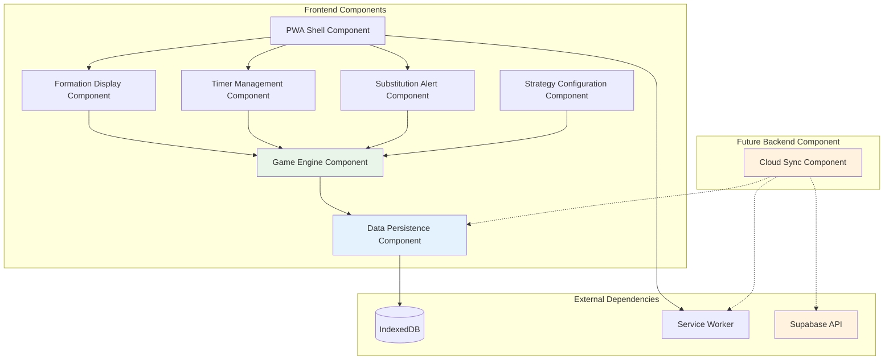

# Components

Based on the architectural patterns, tech stack, and data models defined above, I've identified the major logical components across the fullstack Match Manager system. These components represent both frontend modules and future backend services, with clear boundaries and interfaces.

## PWA Shell Component

**Responsibility:** Provides the Progressive Web App foundation including service worker management, offline detection, installation prompts, and app lifecycle management.

**Key Interfaces:**
- `ServiceWorkerManager` - Controls service worker registration and updates
- `OfflineStateProvider` - Exposes online/offline status to other components
- `PWAInstallPrompt` - Manages app installation user experience

**Dependencies:** Browser APIs (Service Worker, Web App Manifest, Network Information)

**Technology Stack:** Next.js App Router, Service Worker API, Web App Manifest, React Context for offline state management

## Game Engine Component

**Responsibility:** Core business logic for game management including formation logic, substitution calculations, playing time algorithms, and game state management. Operates entirely client-side with no external dependencies.

**Key Interfaces:**
- `FormationManager` - Manages tactical formations and position assignments
- `SubstitutionEngine` - Calculates substitution recommendations based on strategy
- `PlayingTimeCalculator` - Real-time playing time tracking and balance calculations
- `GameStateManager` - Coordinates game status, timers, and transitions

**Dependencies:** Data Persistence Component for state storage

**Technology Stack:** TypeScript classes in `packages/game-engine`, React Context for state exposure, Web Workers for complex calculations

## Data Persistence Component

**Responsibility:** Manages all local data storage using IndexedDB with schema migration, data validation, and query optimization. Provides abstraction layer over IndexedDB complexity.

**Key Interfaces:**
- `TeamRepository` - CRUD operations for teams and settings
- `PlayerRepository` - Player management with position eligibility
- `GameRepository` - Game data with complex relational queries
- `SyncRepository` - Data preparation for future cloud synchronization

**Dependencies:** IndexedDB browser API

**Technology Stack:** IndexedDB with Dexie.js wrapper, TypeScript repositories pattern, data validation using Zod schemas

## Formation Display Component

**Responsibility:** Visual representation of soccer field with real-time player positioning, substitution status color coding, and touch-optimized interactions for outdoor coaching conditions.

**Key Interfaces:**
- `FieldRenderer` - SVG-based soccer field visualization
- `PlayerPositionManager` - Drag-and-drop player positioning
- `SubstitutionVisualizer` - Color-coded substitution status display

**Dependencies:** Game Engine Component for formation data, UI Component Library for touch interactions

**Technology Stack:** React 19 with SVG rendering, Tailwind CSS for responsive design, React DnD for touch interactions, Canvas API for performance optimization

## Timer Management Component

**Responsibility:** Independent game clock management with persistence across app interruptions, period tracking, and integration with playing time calculations.

**Key Interfaces:**
- `GameTimer` - Start/stop/reset functionality independent of system clock
- `PeriodManager` - First half, halftime, second half tracking
- `TimerPersistence` - Background timer continuation via Service Worker

**Dependencies:** PWA Shell Component for background processing, Data Persistence Component for timer state

**Technology Stack:** Web Workers for background timing, Service Worker for persistence, React Context for timer state sharing

## Substitution Alert Component

**Responsibility:** Proactive substitution recommendations based on configured strategies with advance warnings and manual confirmation workflows.

**Key Interfaces:**
- `AlertEngine` - Strategy-based substitution recommendation logic
- `NotificationManager` - Visual and haptic alert delivery
- `ConfirmationWorkflow` - Two-step substitution confirmation process

**Dependencies:** Game Engine Component for strategy logic, Timer Management Component for timing triggers

**Technology Stack:** React Context for alert state, Web Notifications API, Vibration API, React portals for modal overlays

## Strategy Configuration Component

**Responsibility:** Substitution strategy management including equal playing time, minimum minutes, and custom strategies with real-time balance monitoring.

**Key Interfaces:**
- `StrategyDefinition` - Configuration of playing time strategies
- `BalanceCalculator` - Real-time playing time variance tracking
- `StrategyValidator` - Pre-game feasibility validation

**Dependencies:** Game Engine Component for calculations, Data Persistence Component for strategy storage

**Technology Stack:** TypeScript strategy pattern implementation, React forms with validation, Chart.js for balance visualization

## Future Cloud Sync Component

**Responsibility:** Background data synchronization with cloud services for multi-device support and data backup. Operates independently of core functionality.

**Key Interfaces:**
- `SyncManager` - Coordinates upload/download operations
- `ConflictResolver` - Handles data conflicts between devices
- `BackgroundSync` - Service Worker background synchronization

**Dependencies:** Data Persistence Component for local data, PWA Shell Component for background processing

**Technology Stack:** Service Worker Background Sync, Supabase client, conflict resolution algorithms, retry logic with exponential backoff

## Component Diagrams

