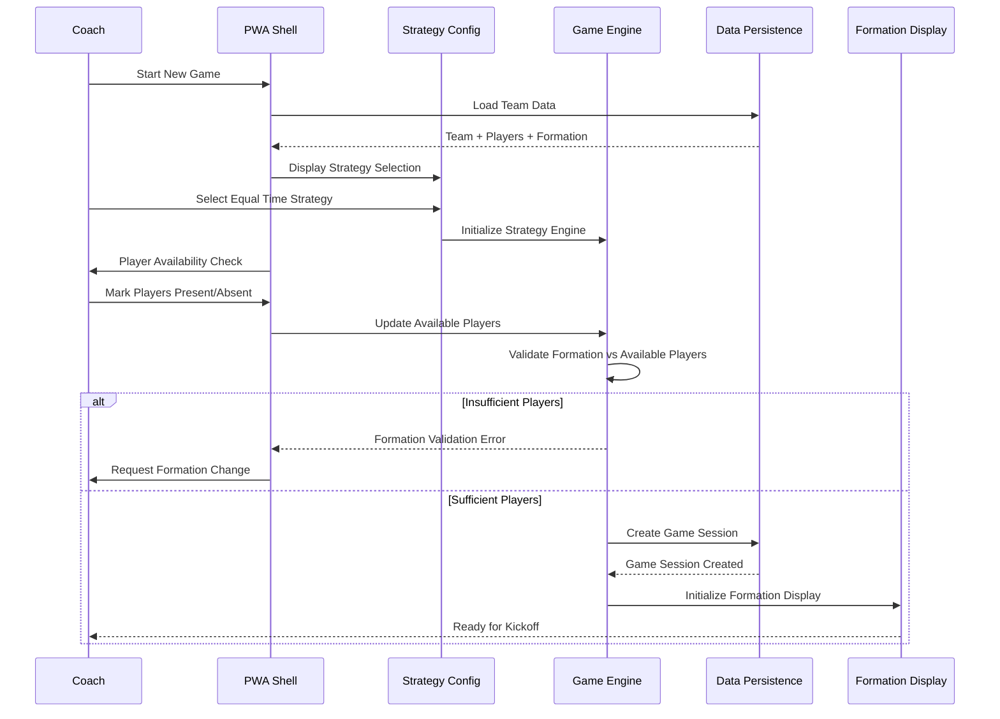
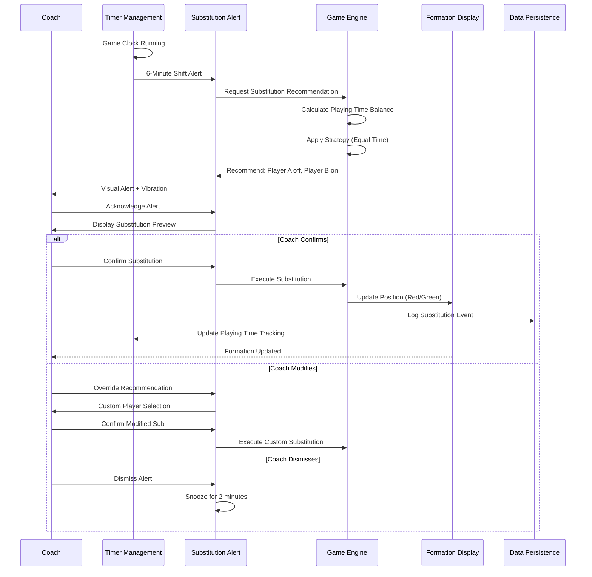
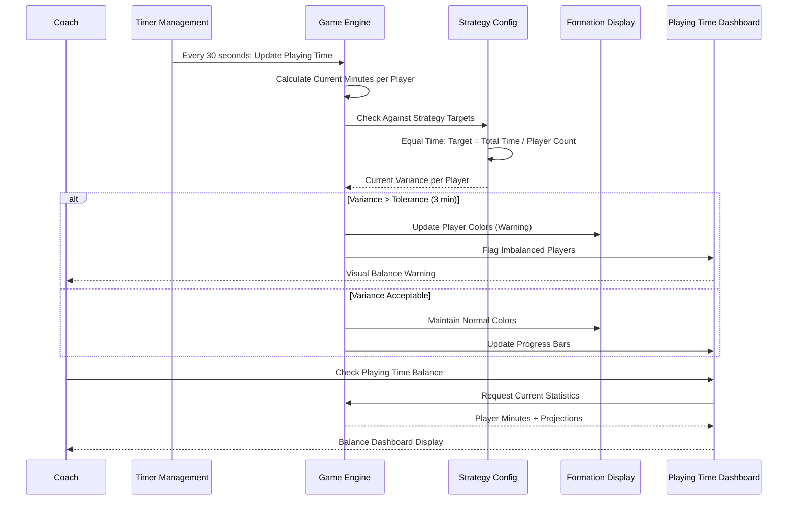
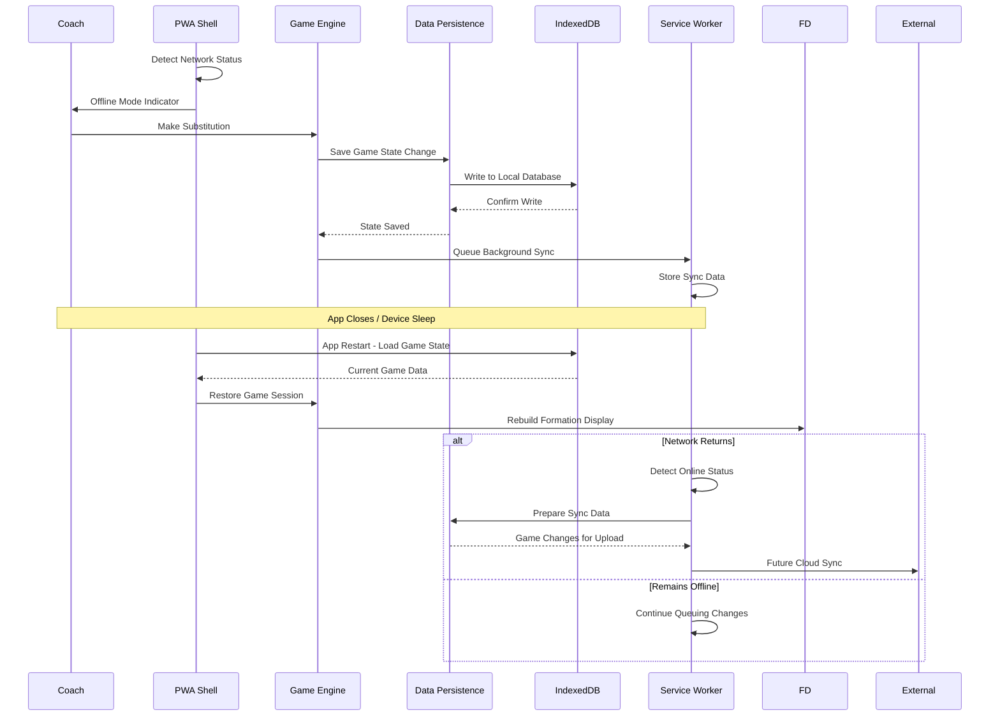
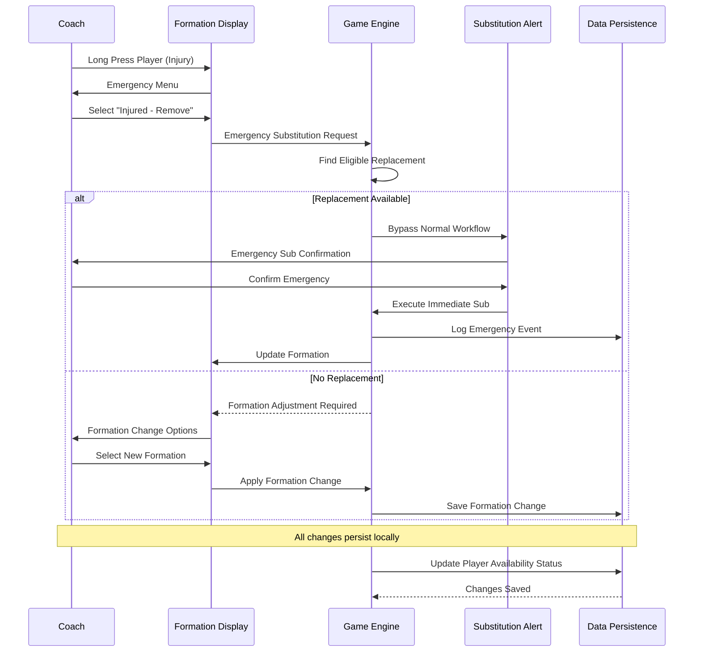

# Core Workflows

The following sequence diagrams illustrate key system workflows that demonstrate component interactions and clarify critical architecture decisions for the Match Manager PWA.

## Game Setup and Initialization Workflow

## Real-Time Substitution Alert and Execution Workflow

## Playing Time Balance Monitoring Workflow

## Offline-First Data Persistence Workflow

## Emergency Substitution and Error Handling Workflow

