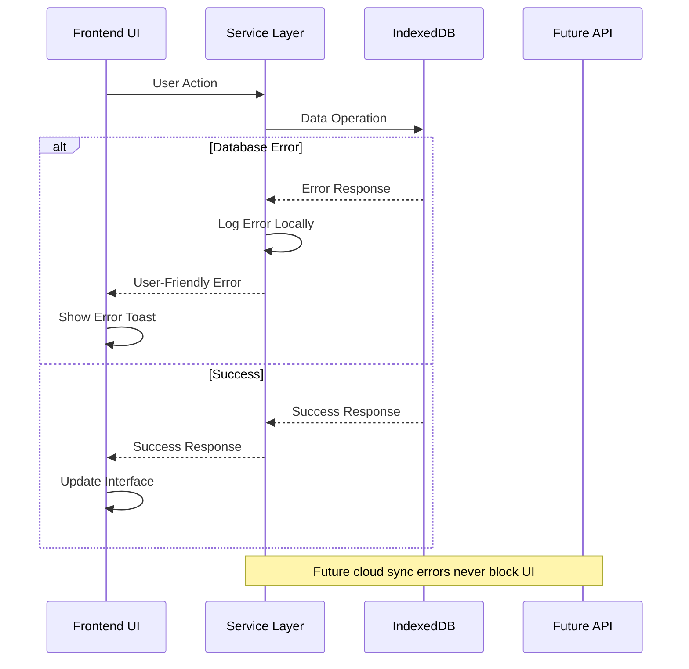

# Error Handling Strategy

## Error Flow



## Error Response Format

```typescript
interface ApiError {
  error: {
    code: string;
    message: string;
    details?: Record<string, any>;
    timestamp: string;
    requestId: string;
  };
}
```

## Frontend Error Handling

```typescript
const handleFormationError = (error: Error) => {
  console.error('Formation error:', error);

  // Show user-friendly message
  toast.error('Unable to update formation. Please try again.');

  // Log for debugging
  errorLogger.log('formation_update_failed', {
    error: error.message,
    stack: error.stack,
    gameId: currentGame.id,
    timestamp: new Date().toISOString()
  });
};
```

## Backend Error Handling

```typescript
export function handleAPIError(error: unknown): NextResponse {
  const requestId = crypto.randomUUID();

  console.error(`API Error [${requestId}]:`, error);

  if (error instanceof ValidationError) {
    return NextResponse.json({
      error: {
        code: 'VALIDATION_ERROR',
        message: error.message,
        details: error.details,
        timestamp: new Date().toISOString(),
        requestId
      }
    }, { status: 400 });
  }

  // Generic error response
  return NextResponse.json({
    error: {
      code: 'INTERNAL_SERVER_ERROR',
      message: 'An unexpected error occurred',
      timestamp: new Date().toISOString(),
      requestId
    }
  }, { status: 500 });
}
```
