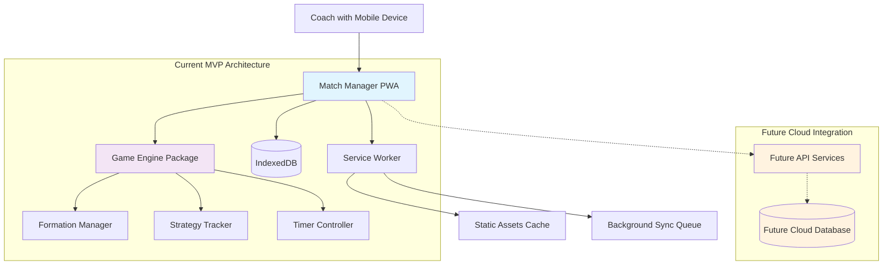

# High Level Architecture

## Technical Summary

Match Manager employs a **client-first Progressive Web App architecture** deployed as a static Next.js application with comprehensive offline capabilities. The frontend React 19 application handles all core game management logic locally using IndexedDB for persistence, while future serverless functions will provide optional cloud sync and organization features. Key integration points include PWA service worker for offline reliability, IndexedDB for complex game state management, and touch-optimized mobile interface for sideline coaching. The architecture prioritizes **Vercel edge deployment** for global performance with potential Supabase integration for future cloud features, achieving the PRD's cognitive load reduction goals through real-time local processing and visual formation management.

## Platform and Infrastructure Choice

**Platform:** Vercel + Supabase
**Key Services:** Vercel Edge Functions, Supabase (future), IndexedDB (primary), Service Worker
**Deployment Host and Regions:** Vercel global edge network with focus on North American youth soccer markets

## Repository Structure

**Structure:** Monorepo with clear separation between PWA frontend and future API services
**Monorepo Tool:** npm workspaces (lightweight, already supported by existing Next.js setup)
**Package Organization:**
- `apps/web` - Main PWA application
- `packages/shared` - TypeScript interfaces and utilities
- `packages/game-engine` - Core game logic (formations, timers, strategies)
- `apps/api` - Future serverless functions for cloud sync

## High Level Architecture Diagram

## Architectural Patterns

- **Client-First PWA Pattern:** All critical functionality operates locally with cloud sync as enhancement - _Rationale:_ Ensures reliability during games without internet connectivity, core requirement for sideline coaching_

- **Offline-First Data Pattern:** IndexedDB as primary storage with eventual cloud synchronization - _Rationale:_ Game data must persist through device restarts and network failures during 90-minute sessions_

- **Component-Based UI with Context State:** React 19 components with Context API for complex game state - _Rationale:_ Enables real-time UI updates for formation changes and substitution alerts while maintaining performance_

- **Service Worker Background Processing:** Service worker handles timer persistence and background sync preparation - _Rationale:_ Maintains game timers even when app is backgrounded, critical for accurate playing time calculations_

- **Domain-Driven Game Engine:** Separate packages for game logic (formations, strategies, timers) independent of UI - _Rationale:_ Enables comprehensive testing of game calculations and potential future platform reuse_
